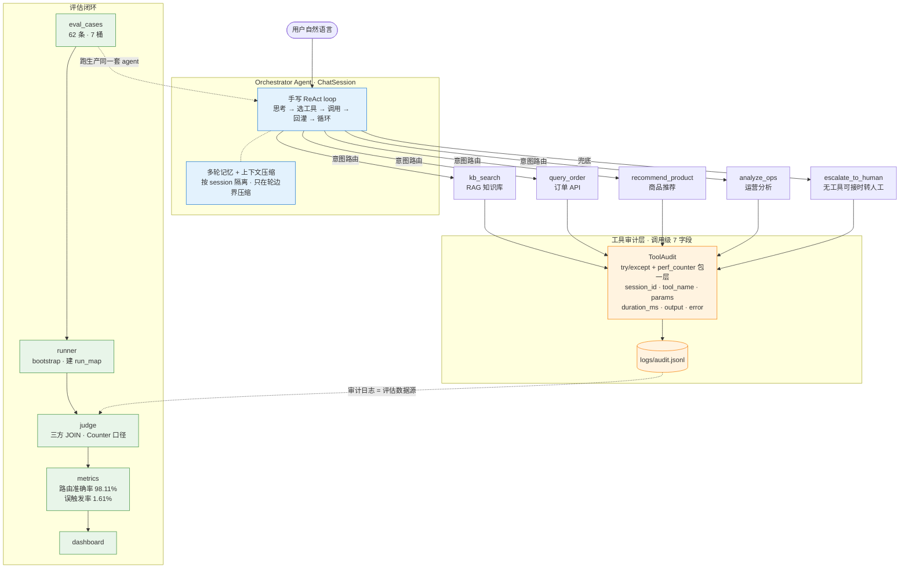

# 私域电商运营 AI Agent 工作台

面向私域电商运营场景的 AI Agent 工作台。一个 **Orchestrator Agent**（纯手写 ReAct loop）接收自然语言请求，通过工具编排完成订单查询 / 客服问答 / 商品推荐 / 运营分析的任务闭环；**每次工具调用都被审计层记录，由此长出一套可回归的评估体系**。

核心思路：工具审计层（可观测性）→ 评估集（62 条，按难度分桶）→ 判分器 → 用评估数据驱动 Agent 迭代，让路由质量可度量、改进有依据。

## 能力

| 工具 | 场景 | 实现 |
|---|---|---|
| `kb_search` | 客服问答 | RAG（通义 text-embedding-v3 + Chroma） |
| `query_order` | 订单查询 | mock 订单 API |
| `recommend_product` | 商品推荐 | 类目必填 + 预算选填，按价升序 Top3 |
| `analyze_ops` | 运营分析 | GMV（剔除已取消）/ 客单价 / 热销 Top3 / 状态分布 |
| `escalate_to_human` | 兜底转人工 | fallback：电商业务相关但无工具可接时调用，**而非硬调最接近的工具** |

LLM = DeepSeek，embedding = 通义 text-embedding-v3，向量库 = Chroma。Agent loop、审计层、判分器、Supervisor 均手写。

## 架构



> **审计粒度刻意定在「调用级」**：token / system_prompt / tool_schema 是轮级/会话级字段，硬塞进调用级 = 混层 + 大字段抄 N 遍。所以审计不记 cost/token，per-tool 耗时画像（query_order 0.01ms 纯内存 vs kb_search 几百 ms embedding+Chroma）才有对比意义。

## 评估体系

- **评估集 62 条**，按难度分 7 桶（`direct` / `rephrased` / `multi_intent` / `confusing` / `negative` / `weakness` / `clarify`），bucket 轴与工具配比轴正交，可 GROUP BY 拆解。
- **双闸门难样本准入**：闸门 A（label 站得住，一句规则说清正解）+ 闸门 B（写得出「赌模型栽哪」的 `trap`）。两闸都过才算有鉴别力的难样本。
- **两个 headline 指标，口径正交**：
  - 路由准确率 = 正样本里期望工具命中比例（分母只数正样本）
  - 误触发率 = 全集里调了「期望集之外」工具的占比（正负样本都参与）
- **判分器 Counter 口径**：multiset 比对，能抓「同工具该调 2 次只调 1 次」和「冗余重复调对」（白烧 embedding）。

**当前指标（62 条跑生产 Agent）**：路由准确率 **98.11%**，误触发率 **1.61%**。

### 评估驱动迭代（误触发率曲线）

误触发率不是一把降到底，而是「改进 → 反噬 → 再修」迭代出来的：

```
4.84%  baseline（鉴别力来自 weakness 桶：发票/改地址/转人工被硬调兜底）
  ↓    加 fallback 工具 escalate_to_human，给 action-bias 一个合法出口
9.68%  ⚠ 反噬！weakness 转绿，但闲聊(天气/笑话)被 escalate 吞 → negative 桶塌
  ↓    收窄 escalate 描述（排除闲聊/常识/寒暄）—— 工具边界是连通器，得同时划「接什么」和「不接什么」
1.61%  negative 修复
```

核心方法论：**分歧落两种介质**——模型对 → 改数据（`expected_calls`）；模型错 → 改 Agent（工具 `description` / `system_prompt`）。每次改完跑回归网，确认没误伤其他正样本。

### 多 Agent（已评估，数据裁决不上默认）

用一组决策准则（价值证伪 / 对齐已有痛点 / 最小可逆 / 数据裁决）评估了 Supervisor + 专家（agent-as-tool）方案：62 条对比下**多 Agent 净负**（路由准确率持平、调用翻倍）。结论：结构性消歧只是把歧义从工具层搬到 supervisor 层，多一跳 = 多一失败面，故保留实现但不设为默认。审计穿线见 `SupervisorAgent`（调度层注入 NoOpRecorder、专家注入真 Recorder，保证单/多 Agent 在同一口径下对比）。

## 快速开始

```bash
python3 -m venv .venv && source .venv/bin/activate
pip install -r requirements.txt
cp .env.example .env   # 填入 DeepSeek / 通义 API key
python main.py         # CLI 对话
```

在线 Demo：https://ecom-ops-agent.onrender.com

## 跑评估 + Dashboard

```bash
python3 -m src.eval_answer_runner   # 62 条跑生产 Agent，落 audit.jsonl + run_map
python3 -m src.eval_judge           # 三方 JOIN 判分，出 metrics
uvicorn src.api:app --reload
```

打开 `http://127.0.0.1:8000/dashboard`：路由准确率 / 误触发率、bucket 与工具拆解，以及每条错误 case 的「评估期望 / 工具审计 / 会话消息」三方追溯。

### L2 Dashboard 2.0

L2 独立评估最终回复的两个轴：golden point 的要点命中率，以及 answer 中事实断言相对 tool output 池的忠实度。

```bash
python3 -m src.eval_answer_runner
python3 -m src.eval_l2_judge       # 输出 logs/l2_eval_result.json
uvicorn src.api:app --reload
```

打开 `http://127.0.0.1:8000/l2-dashboard`。页面按 `miss` / `unsupported` 筛选问题 case，支持 bucket 拆解，并在详情中展示 question、answer、tool_outputs、golden_points、bucket 五件套。对忠实轴 `UNSUPPORTED` 断言，可在详情抽屉里通过下拉选择或手动输入 root cause、填写备注，并生成可复制摘要；标注会追加保存到 `logs/l2_root_cause_annotations.jsonl`。原 1.0 Dashboard 仍保留在 `/dashboard`。

单 Agent vs 多 Agent 对比：`python3 -m src.eval_compare`。

## 目录

```
src/agent.py              ChatSession（Agent loop）+ SupervisorAgent（多 Agent）
src/tools/                工具实现（query_order / kb_search / recommend_product / analyze_ops / escalate_to_human）
src/schemas/              各工具的 LLM function-calling schema
src/audit.py              ToolAudit + AuditRecorder / NoOpRecorder / MessageRecorder
src/eval_answer_runner.py 评估 runner（bootstrap，建 run_map）
src/eval_judge.py         判分器（Counter 口径，三方 JOIN）
src/eval_l2_judge.py      L2 判分器（要点命中率 + 忠实度）
src/eval_compare.py       单 Agent vs 多 Agent 对比
src/dashboard.py          评估 Dashboard 数据聚合
src/l2_dashboard.py       L2 Dashboard 2.0 数据聚合
src/api.py                FastAPI（/chat + /dashboard + /l2-dashboard）
data/eval_cases.json      评估集（62 条，带 bucket / trap）
data/orders.json          mock 订单（一份喂 query_order + analyze_ops）
logs/audit.jsonl          工具审计日志
main.py                   CLI 入口
```
