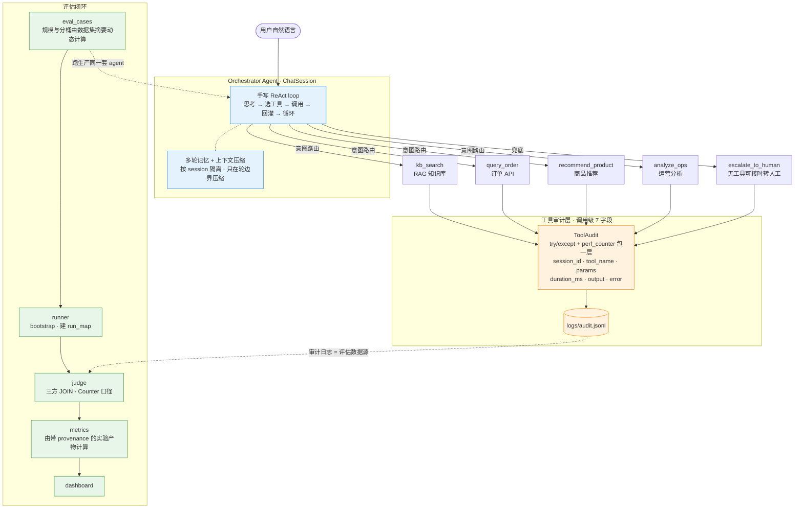

# 私域电商运营 AI Agent 工作台

面向私域电商运营场景的 AI Agent 工作台。一个 **Orchestrator Agent**（纯手写 ReAct loop）接收自然语言请求，通过工具编排完成订单查询 / 客服问答 / 商品推荐 / 运营分析的任务闭环；**每次工具调用都被审计层记录，由此长出一套可回归的评估体系**。

核心思路：工具审计层（可观测性）→ 版本化评估集（按难度分桶）→ 判分器 → 用评估数据驱动 Agent 迭代，让路由质量可度量、改进有依据。

## 能力

| 工具 | 场景 | 实现 |
|---|---|---|
| `kb_search` | 客服问答 | RAG（通义 text-embedding-v3 + Chroma） |
| `query_order` | 订单查询 | mock 订单 API |
| `recommend_product` | 商品推荐 | 类目必填 + 预算选填，按价升序 Top3 |
| `analyze_ops` | 运营分析 | GMV（剔除已取消）/ 客单价 / 热销 Top3 / 状态分布 |
| `escalate_to_human` | 兜底转人工 | fallback：电商业务相关但无工具可接时调用，**而非硬调最接近的工具** |

LLM 与 embedding 模型均由环境变量配置，默认分别见 `LLM_MODEL` 与 `EMBED_MODEL`；向量库 = Chroma。Agent loop、审计层、判分器、Supervisor 均手写。

## 架构


```mermaid
flowchart TD
    U([用户自然语言]) --> ORCH

    subgraph CORE["Orchestrator Agent · ChatSession"]
        ORCH["手写 ReAct loop<br/>思考 → 选工具 → 调用 → 回灌 → 循环"]
        MEM["多轮记忆 + 上下文压缩<br/>按 session 隔离 · 只在轮边界压缩"]
        ORCH -.- MEM
    end

    ORCH -->|意图路由| KB["kb_search<br/>RAG 知识库"]
    ORCH -->|意图路由| OD["query_order<br/>订单 API"]
    ORCH -->|意图路由| RC["recommend_product<br/>商品推荐"]
    ORCH -->|意图路由| AN["analyze_ops<br/>运营分析"]
    ORCH -->|兜底| ES["escalate_to_human<br/>无工具可接时转人工"]

    KB --> AUDIT
    OD --> AUDIT
    RC --> AUDIT
    AN --> AUDIT
    ES --> AUDIT

    subgraph AUD["工具审计层 · 调用级 7 字段"]
        AUDIT["ToolAudit<br/>try/except + perf_counter 包一层<br/>session_id · tool_name · params<br/>duration_ms · output · error"]
        AUDIT --> LOG[("logs/audit.jsonl")]
    end

    subgraph EVAL["评估闭环"]
        RUN["runner<br/>bootstrap · 建 run_map"]
        EC["eval_cases<br/>规模与分桶由数据集摘要动态计算"] --> RUN
        RUN --> JUDGE["judge<br/>三方 JOIN · Counter 口径"]
        JUDGE --> MET["metrics<br/>由带 provenance 的实验产物计算"]
        MET --> DASH["dashboard"]
    end

    LOG -.->|审计日志 = 评估数据源| JUDGE
    EC -.->|跑生产同一套 agent| ORCH

    classDef core fill:#e3f2fd,stroke:#1976d2
    classDef audit fill:#fff3e0,stroke:#f57c00
    classDef eval fill:#e8f5e9,stroke:#388e3c
    class ORCH,MEM core
    class AUDIT,LOG audit
    class EC,RUN,JUDGE,MET,DASH eval
```

> **审计粒度刻意定在「调用级」**：token / system_prompt / tool_schema 是轮级/会话级字段，硬塞进调用级 = 混层 + 大字段抄 N 遍。所以审计不记 cost/token，per-tool 耗时画像（query_order 0.01ms 纯内存 vs kb_search 几百 ms embedding+Chroma）才有对比意义。

## 评估体系

- **评估集规模与分桶**由 `make eval-dataset-info`（或 Dashboard 的 `metrics.case_count`）从 `data/eval_cases.json` 动态计算；bucket 轴与工具配比轴正交，可 GROUP BY 拆解。
- **双闸门难样本准入**：闸门 A（label 站得住，一句规则说清正解）+ 闸门 B（写得出「赌模型栽哪」的 `trap`）。两闸都过才算有鉴别力的难样本。
- **两个 headline 指标，口径正交**：
  - 路由准确率 = 正样本里期望工具命中比例（分母只数正样本）
  - 误触发率 = 全集里调了「期望集之外」工具的占比（正负样本都参与）
- **判分器 Counter 口径**：multiset 比对，能抓「同工具该调 2 次只调 1 次」和「冗余重复调对」（白烧 embedding）。

### 评估驱动迭代

核心方法论：**分歧落两种介质**——模型对 → 改数据（`expected_calls`）；模型错 → 改 Agent（工具 `description` / `system_prompt`）。每次改完跑回归网，确认没误伤其他正样本。README 不把某次运行的分数写成当前事实：结果应以实验目录的 `manifest.json` 与同目录评估产物为准。

### 多 Agent（对照实验，不作默认）

`SupervisorAgent` 保留为对照实验路径，不是默认主线。任何单/多 Agent 结论都应通过同一数据集、模型配置和重复次数的实验产物比较；审计穿线由调度层注入 `NoOpRecorder`、专家注入真实 `Recorder`，使双方可按同一口径评估。

## 快速开始

```bash
make install
cp .env.example .env   # 填入 DeepSeek / 通义 API key
make cli               # CLI 对话
```

在线 Demo：https://ecom-ops-agent.onrender.com

## 跑评估 + Dashboard

```bash
make eval-dataset-info              # 当前 case 数、bucket 分布、dataset SHA-256；不调用模型
make experiment ARGS="--name baseline --n 4"  # 落带 provenance 的实验结果（会调用模型）
make api
```

实验的 `manifest.json` 记录日期、git commit、dataset SHA-256、轨道和 N；变体配置会记录解析后的模型名（不记录密钥）。打开 `http://127.0.0.1:8000/dashboard`：路由准确率 / 误触发率、当前 case 数、bucket 与工具拆解，以及每条错误 case 的「评估期望 / 工具审计 / 会话消息」三方追溯。选择某次 experiment 时，Dashboard 同时显示该实验 provenance，并检查其 dataset SHA 是否仍与当前数据一致。

### L2 Dashboard 2.0

L2 独立评估最终回复的两个轴：golden point 的要点命中率，以及 answer 中事实断言相对 tool output 池的忠实度。

```bash
make eval-run
make eval-l2   # 输出 logs/l2_eval_result.json
make api
```

打开 `http://127.0.0.1:8000/l2-dashboard`。页面按 `miss` / `unsupported` 筛选问题 case，支持 bucket 拆解，并在详情中展示 question、answer、tool_outputs、golden_points、bucket 五件套。对忠实轴 `UNSUPPORTED` 断言，可在详情抽屉里通过下拉选择或手动输入 root cause、填写备注，并生成可复制摘要；标注会追加保存到 `logs/l2_root_cause_annotations.jsonl`。原 1.0 Dashboard 仍保留在 `/dashboard`。

单 Agent vs 多 Agent 对比：`make eval-compare`。

## 目录

```
src/agent.py              ChatSession（Agent loop）+ SupervisorAgent（多 Agent）
src/tools/                工具实现（query_order / kb_search / recommend_product / analyze_ops / escalate_to_human）
src/schemas/              各工具的 LLM function-calling schema
src/audit.py              ToolAudit + AuditRecorder / NoOpRecorder / MessageRecorder
src/eval/                 评估 harness（answer_runner / judge / compare / retrieval）
src/eval/l2/              L2 评估（判分器 / fixtures / 标注 / dashboard）
src/experiment/           消融实验（runner / compare / kb）
src/dashboard/            评估 Dashboard 数据聚合
src/api.py                FastAPI（/chat + /dashboard + /l2-dashboard）
scripts/                  开发辅助命令（如评估集规模与 SHA 摘要）
data/eval_cases.json      评估集（带 bucket / trap；规模由 eval-dataset-info 动态读取）
data/orders.json          mock 订单（一份喂 query_order + analyze_ops）
logs/audit.jsonl          工具审计日志
main.py                   CLI 入口
```
